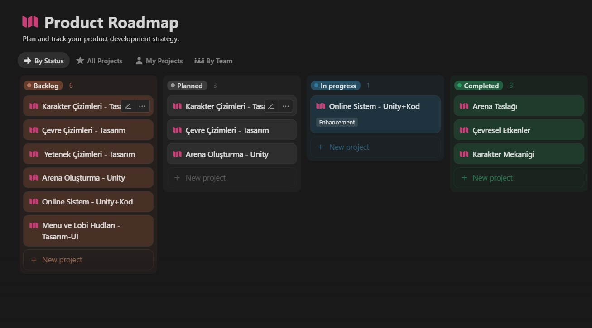
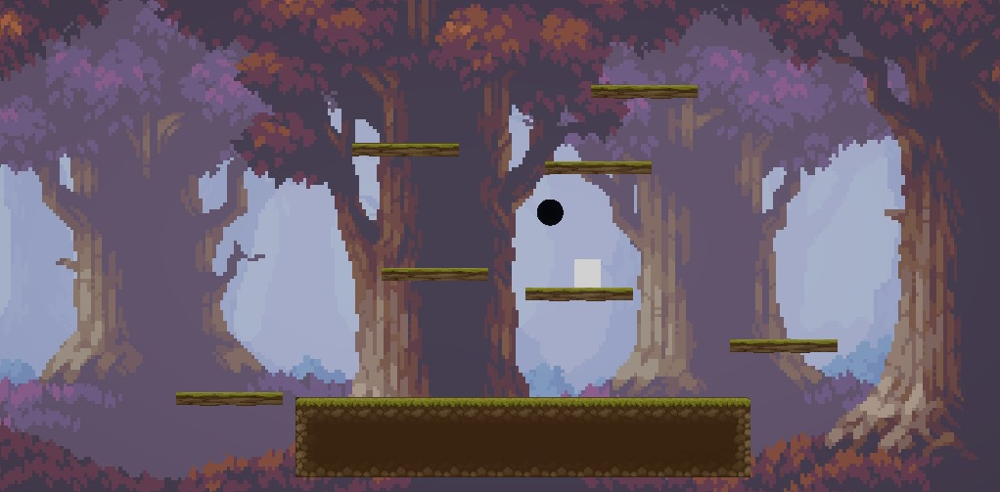

## Jüriye Not
Bird 56’da kullanılan grafik ve modeller, zaman kısıtı nedeniyle hazır asset’ler üzerinden seçilmiştir.

Merhaba ben Muhammed Zübeyir Çağlar grubumuzda aktiflik sorunu olduğundan dolayı, maalesef böyle bir yönteme başvurdum. Başlarda 3 kişi, "top oyunu" dediğimiz, party öğeleri multiplayer olan bir oyun geliştirecektik. Ancak ekibin sorumsuzluğu yüzünden tek başıma kaldım. Tüm yük omuzlarıma bindi. Büyük hedeflerle, umutlarla başladığım bootcamp süreci benim için hayal kırıklığı oldu, şevkim kırıldı.

Belki de tek başıma bunu geliştirebilirdim; ancak herkes en az 3-5 kişilik ekiplerle oyun geliştireceği için, kendimi o rekabetin içine sokabileceğimi düşünmedim. Herkesten çok daha fazla zamanımı vermem, günlerimi harcamam gerekirdi.

Onun yerine bu vaktimi boş geçirmedim. Akademi dışında bulunduğum bir ekip var, o ekibimle kendi oyunumuz üzerinde durduk ve belli yerlere geldik.

Umarım mezun olabilirim. Şimdiden teşekkür ederim.

## Sprint Planı
Sprint Notları: Belli bir sprint planı asla olmadı ekibim yüzünden. Ve bende bundan dolayı burayı boş bırakacağım. Eski projenin yazıları Sprint planlarını bırakacağım inceleyebilirsiniz. Ayrıca ilk proje için hazırladığım karakter spritelarınıda aşağıya koyacağım.

https://drive.google.com/drive/folders/1MVvhnZuQV970Q3aSJrTq_ceTwFCPQ-EQ?usp=sharing

## u56-Bootcamp2025Projesi
Bu GitHub deposu, Oyun ve Uygulama Akademisi kapsamında yürütülen yoğun tempolu sürecin bir ürünü olan u97-Bootcamp takımımız tarafından hazırlanmıştır. Unity oyun motoru kullanarak geliştirdiğimiz bu proje, akademi süresince kazandığımız teorik bilgileri pratiğe dönüştürme ve ekip olarak gerçek bir oyun geliştirme sürecini deneyimleme fırsatı sundu.

Unity’nin sağladığı araçlarla oyun mekaniklerini oluşturduk, grafikleri entegre ettik ve kodlama becerilerimizi pekiştirdik. Bu depo, hem bireysel gelişimimizi hem de ekip halinde ulaştığımız hedefleri ortaya koyan bir çalışma niteliği taşımaktadır.

## Ürün Açıklaması
Bird 56, 2025 Bootcamp sürecinde takım olarak mezuniyet hedefiyle geliştirdiğimiz bir 2D platform oyunudur. Oyunumuz, "Flappy Bird" temasına dayansa da yalnızca bir klon değil; tamamlanmış bir ürün ortaya koyma amacı taşıyan, kısa sürede oynanabilir ve eğlenceli bir projedir.

Oyunun amacı, ana karakter olan kuş ile engellerin arasından geçerek mümkün olan en yüksek skoru elde etmektir. Oyuncu, “Replay” butonuyla oyuna sıfırdan başlayarak dilediği kadar yeniden deneme hakkına sahiptir.

## Ürün Özellikleri
Oyuncular düşünerek strateji geliştirme, reflekslerini test etme ve hızlı karar verme gibi yeteneklerini geliştirebilir.

Kısa süreli oyun yapısı sayesinde boş zamanlarda stres atmak ve zihni dağıtmak için keyifli bir alternatif sunar.

Tüm yaş gruplarına hitap eder, oyun oynamanın yaşının olmadığını hatırlatır.

## Hedef Kitle
Platform oyunlarına ilgi duyanlar

Günlük hayatın stresinden uzaklaşmak isteyenler

İçerik üreticileri ve yayıncılar

Basit ama eğlenceli mekanikleri seven her yaştan kullanıcı

https://github.com/user-attachments/assets/62e778ee-7bbc-4834-9405-9fe6db343e1f

---------------------------------------------------------------------------------------
# 🎮 Top Drop Arena

##  Takım İsmi  
**YZTA59**

##  Takım Üyeleri  
- **Muhammed Zübeyir Çağlar** – Product Owner  
- **Sude Çokyaşar** – Scrum Master  
- **Metin Ertekin Küçük** – Developer  
- **Debiz Karabulut** – Developer  
- **Hüseyin Burak Sakar** – Developer  

##  Oyun Açıklaması  
**Top Drop Arena**, 4–5 kişilik oyuncularla oynanabilen, hızlı tempolu ve çevresel etkileşimlere dayalı bir **multiplayer arcade** oyunudur. Her bölüm, kendine özgü mekanikler içerir. 

##  Hedef Kitle  
- Rekabetçi oyuncular  
- Arkadaşlarıyla kısa süreli oyunlar oynamayı sevenler  
- 7 yaş ve üzeri oyuncular  
- Casual & arena dövüş türünü sevenler  

---

#  Sprint 1

- **Sprint puan tamamlama mantığı**:  
  Proje boyunca tamamlanması gereken toplam backlog puanı şu an için **85 puan** olarak belirlenmiştir.  
  ##  Backlog Kalemleri ve Puanları
	| İş Kalemi                              | Puan |
	|----------------------------------------|------|
	| Genel oynanış ve mekanik oluşturma     | 10   |
	| Karakter çizimleri                     | 10   |
	| Çevre çizimleri                        | 10   |
	| Yetenek mekanikleri tasarımı           | 15   |
	| Yetenek mekaniklerini kodlama          | 20   |
	| Arena oluşturmak                       | 20   |
	| **Toplam**                              | **85** |
 
  İlk sprintte tamamlanması beklenen işlerin toplamı, grup üyelerinin müsaitlik durumlarından ötürü **10 puan** olup bu hedef başarıyla gerçekleştirilmiştir.

---

## Sprint 1 Süreci  
- Arena mekanikleri planlandı:  
  - Zincirli topun hareketi  
  - Platform sistemleri ve çerçeve mantığı  
- Oyuncu hareketi (yatay/dikey) ve fizik sistemine ilk geçiş bu sprintte hedeflendi.

---

##  Daily Scrum  
- Takım içi iletişim **WhatsApp grubu** üzerinden yürütüldü.  
- Gün içerisinde iletişim sağlanararak proje takip edildi. 

---

##  Sprint Board Updates  
Proje backlog takibi için notion kullanılmaktadır.
###  Sprint 1 Notion Görseli  

---

##  Sprint Review  
- Arena ve çevre taslağı başarıyla oluşturuldu.  
- Oyuncu çarpışma sistemi entegre edildi.  
- Spawn noktaları ve hareketli platformlar taslak olarak tamamlandı.  
- **Geribildirim**:  
  - Oyuncu fiziği optimize edilmeli  
  - Harita tasarımı için renk paleti netleştirildi

---

##  Sprint-1 Ürün Durumu Ekran Görüntüsü  

---

##  Sprint 1 Özeti  
| Kategori               | Açıklama                                      |
|------------------------|-----------------------------------------------|
| **Sprint Puanı**       | 10 / 10                                       |
| **Tamamlanan İş**      | Arena taslağı, çevresel etkenler |
| **Geliştirilen Özellik** | Karakter mekaniği             |
| **Sorunlar**           | Tasarım sürecinde zamanlama                   |
| **Başarı Durumu**      | Sprint hedefi %100 tamamlandı                 |

---

##  Bir Sonraki Sprint  
- Oyun içi UI çalışmaları  
- Yeni harita (çevre) taslağı  
- Karakter animasyonlarının geliştirilmesi
